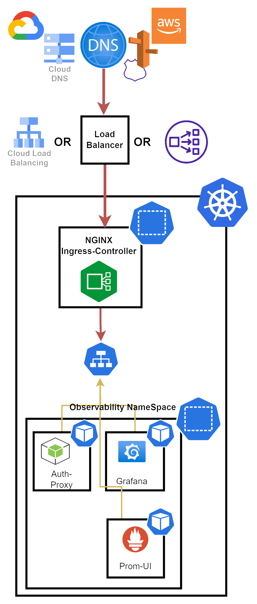

[TOCM]

### Features

------------

- Deployable on both GCP and AWS by default
- Grafana is both authenticated using Normal users and IDP (OAuth / AzureAD)
- Prometheus Metrics collection
- Prom tail Logs Sys.outs collection
- AWS CloudWatch prometheus Metrics collection
- Datastax Prometheus Metrics collection
- Fully managed Log collection (Grafana cloud for Prometail)
- Fully managed metrics collection (GCP)
- Prom-UI passthrough to GCP for grafana Authentication 
- Reverse Authentication Proxy for Grafana Embeded

<!-- # Archtecture -->
## Overall Architecture

## Prom-UI
Unfourenticaly Grafana's authntication method options do not include Service Account (OAuth2) Hence Direct communication with GCP is not possibole, Thus
Prom-UI's sole purpose in this Architecture is to server as a passthrough to GCP's Managed Promethus
having it Authinticate with GCP's Managed Promethus and serve Grafana back using its Rest API on BasicAuth using a cluster ip

## Reverse Authentication Proxy
Soly for Automatic Authentication with Grafana when using its Embeded Feature -
A reverse Proxy that Populats User and Pass Credentials in request from Http Parameters